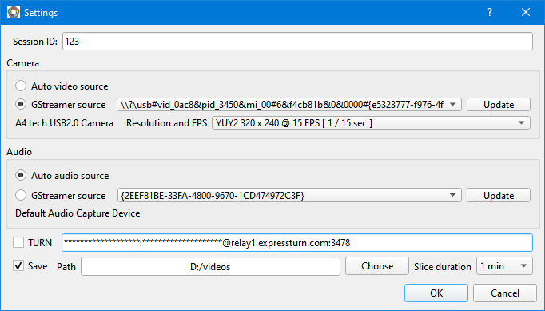
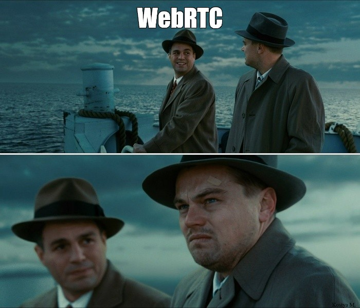

# webrtc-ui
Experimenting with WebRTC and Qt

Based on https://gitlab.freedesktop.org/gstreamer/gstreamer/-/blob/main/subprojects/gst-examples/webrtc/sendrecv/gst/webrtc-sendrecv.c

Uses https://ntfy.sh/ for negotiation, SSE based on https://github.com/radiospiel/sse.

✅ Strengths of the Protocol
- Bootstrapping simplicity. ntfy.sh (a public pub/sub broker over HTTP) reused instead of running own signaling server — low ops overhead, very easy to test/deploy.
- Connection uniqueness. Session ID namespace (mediaThorSendRecv_%s) ensures that two peers with the same session ID are mapped to the same SSE channel.
- Each peer has its own GUID, so can differentiate sender vs. receiver.
- Role negotiation. The GUID lexicographic comparison is a simple, deterministic way to pick the offerer/answerer. This avoids “double offer” collisions.
- Handshake (SYN/ACK). A minimal two-step handshake before starting WebRTC exchange prevents mis-parsing of random messages and gives you a clear synchronization point.
- Message framing. Prefixing each message with the sender’s GUID + newline ensures you can distinguish origin and validate consistency across session.

Free TURN server used: https://www.expressturn.com/

